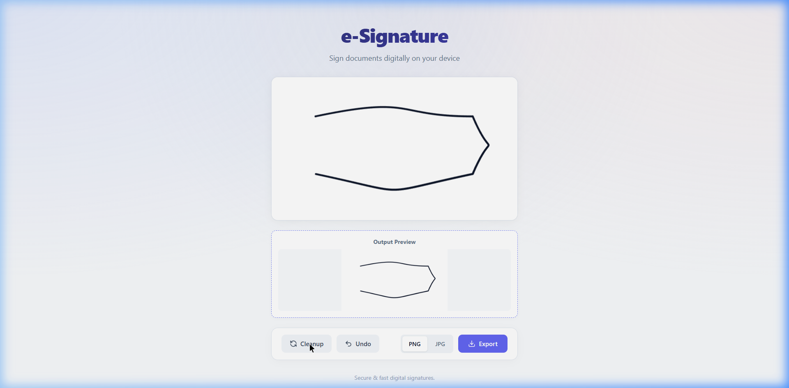

# e-Signature App 🖋️


A modern, responsive, and premium digital signature web application built with **Vue 3**, **TypeScript**, and **Vite**. 
It allows users to seamlessly draw their signatures on any device and export them in popular image formats.

## ✨ Features
- **Native Drawing Experience**: Smooth and dynamic pen strokes using `signature_pad`. The pen automatically adjusts thickness based on your drawing speed for a realistic feel.
- **Custom Pen Cursor**: A true-to-life SVG pen icon follows your cursor while signing.
- **Live Preview**: See your output directly in real-time as you type or switch between image formats.
- **Cleanup & Undo**: Easily erase the whole pad or just undo your last stroke if you make a mistake.
- **Export Options**: Download your final signature securely in **PNG** (transparent) or **JPG** format.
- **Fully Responsive**: Designed with a mobile-first premium glassmorphism UI that automatically scales constraints and provides a great experience on any screen size.

## 🚀 Tech Stack
- **Framework**: [Vue 3](https://vuejs.org/) (Composition API & `<script setup>`)
- **Language**: [TypeScript](https://www.typescriptlang.org/)
- **Build Tool**: [Vite](https://vitejs.dev/)
- **Core Library**: `signature_pad` for canvas processing
- **Icons**: `lucide-vue-next`
- **Styling**: Vanilla CSS with CSS Variables for theme management

## 📦 Installation & Setup

1. **Clone the repository**
   ```bash
   git clone https://github.com/hoanganhtuxz/SignatureArea.git
   cd SignatureArea
   ```

2. **Install dependencies**
   Make sure you have Node.js installed.
   ```bash
   npm install
   ```

3. **Run the development server**
   ```bash
   npm run dev
   ```
   *The app will be available at `http://localhost:5173`.*

4. **Build for production**
   ```bash
   npm run build
   ```

## 📸 Screenshots & Usage
1. Open the application in your browser.
2. Sign your document inside the designated box. The dynamic pen tool will capture your signature natively.
3. Check the **Output Preview** section below the canvas.
4. Select your preferred file format (`PNG` or `JPG`).
5. Click **Export** to securely download the image locally.



---

*Made with Vue 3 💚*